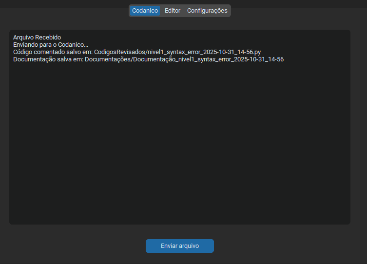
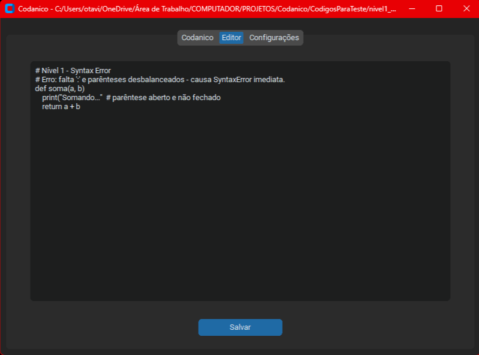
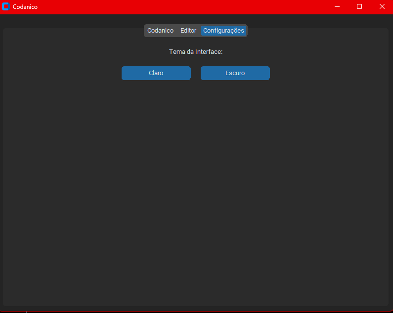
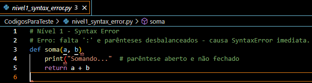
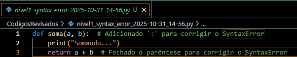
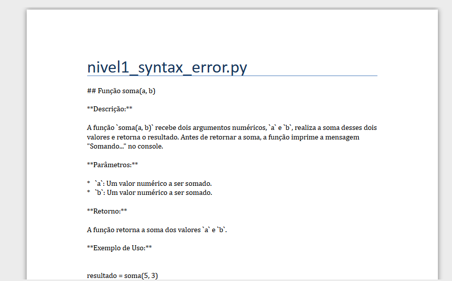

# 🤖💻 Codanico Agente de IA que cuida de codigos

[]((https://github.com/Otavio72/Codanico/blob/main/LICENSE))

Agente de IA desenvolvido em Python capaz de corrigir códigos automaticamente e gerar documentação técnica.

---

## 🛠️ Sobre o projeto

Utiliza a API do Gemini (Google AI) para detectar e corrigir erros de sintaxe, redundâncias e falhas lógicas, além de otimizar trechos de código e explicar o raciocínio por trás das correções.
O sistema integra automação de tarefas, geração de relatórios e feedback em tempo real — um exemplo prático de RPA + IA aplicada à engenharia de software.


### Funcionalidades principais:

- 🤖 Analise e correção de codigos e geracao de documentação com **GEMINI API**
- 🌙 Interface gráfica com **CustomTkinter**
---

## 💻 Layout da aplicação

### Página inicial


### Página de Status


### Menu de Stints


### Pagina de analise


### Pagina de analise


### Pagina de analise


---

## 🗂️ Codigos feitos pelo codanico

## Datalogger


---

## 🚀 Tecnologias utilizadas

### 🔙 Back end
- Python
  
### 🎨 Interface
- CustomTkinter
---

### 📦 Instalação

```bash
# clonar repositório
git clone https://github.com/Otavio72/Assetto-Corsa-Stints-ACS-.git

Ative o ambiente virtual:
  python -m venv .venv

No Windows (PowerShell):
  ```powershell
  .venv\Scripts\Activate.ps1

No Linux/macOS:
  source .venv/bin/activate

# acesse o diretorio
cd Assetto-Corsa-Stints-ACS-

Instale as dependências:
  pip install -r requirements.txt

# acesse o dirtetorio da versao demo
cd DEMO

# Rode
  python ACS.vDEMO.py

```

# Autor
Otávio Ribeiro
[🔗LinkedIn](https://www.linkedin.com/in/otávio-ribeiro-57a359197)
